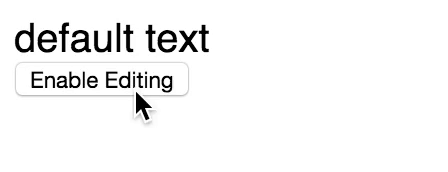

# React-Wysiwyg



This component allows you to have some control over `contenteditable` content. It's especially useful for when you need to implement something that a `textarea` or `input` field can't provide -- i.e., something like Twitter's tweet-box that implements syntax highlighting, and auto-link creation, as seen in the above example. If you're looking for simple inline-editing, this module can work for that too, but I would suggest using traditional `input` fields where possible for improved cross-browser compatibility, and better accessibility.

This module works well in the latest version of Chrome, Safari, Firefox, and iOS Safari. It mostly works in IE, thanks to a series of unfortunate hacks. Further testing for accessibility and browser support is required, and other features need to be implemented, such as paragraph/newline support.

It's worth looking at the supplied example to get a sense of how to use this module.

## Install

```
$ npm install react-wysiwyg
```

## Run the example

```
$ git clone https://github.com/bmcmahen/react-wysiwyg.git && cd react-wysiwyg
$ npm install
$ make build
$ make example
```

## Usage

```javascript
var ContentEditable = require('react-wysiwyg');

var Example = React.createClass({

  getInitialState: function(){
    return {
      html: 'default text',
      placeholder: false,
      editing: false
    }
  },

  render: function(){
    return (
      <div>
        <ContentEditable
          tagName='div'
          onChange={this.onChange}
          html={this.state.html}
          preventStyling
          noLinebreaks
          placeholder={this.state.placeholder}
          placeholderText='Your Name'
          editing={this.state.editing}
        />
        <button onClick={this.enableEditing}>
          Enable Editing
        </button>
      </div>
    );
  },

  onChange: function(textContent, setPlaceholder) {
    if (setPlaceholder) {
      this.setState({
        placeholder: true,
        html: ''
      })
    } else {
      this.setState({
        placeholder: false,
        html: textContent
      })
    }
  },

  enableEditing: function(){
    // set your contenteditable field into editing mode.
    this.setState({ editing: true });
  }

});
```

## Tests

```
make test
```
